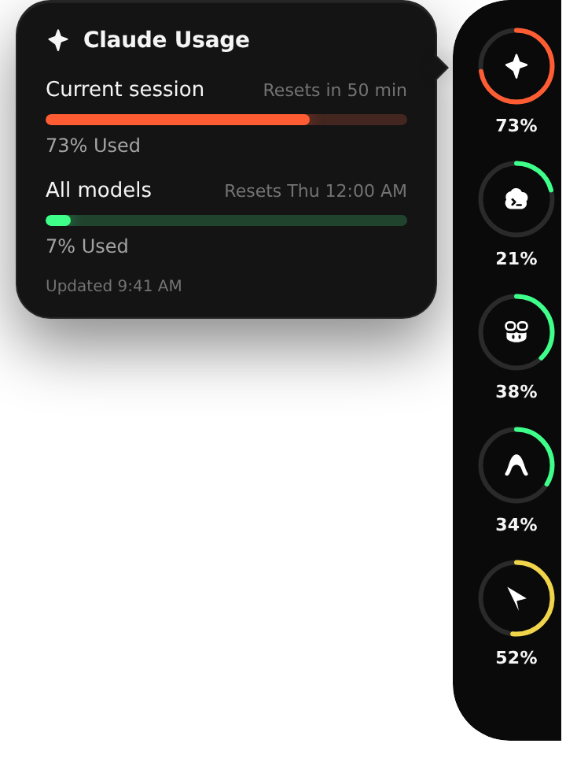
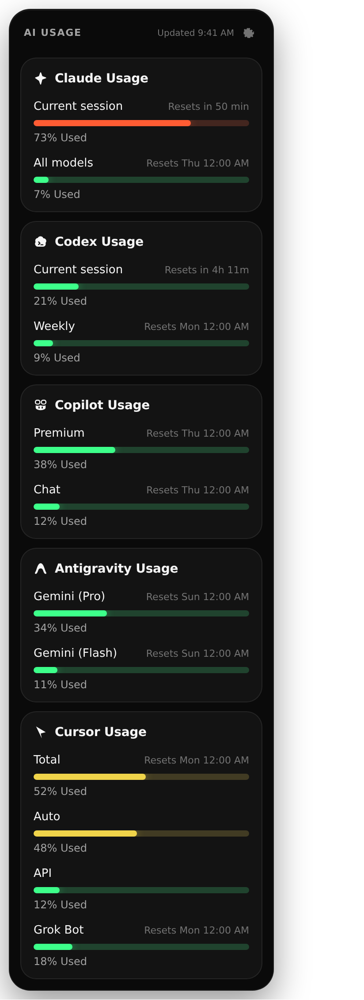

# GenAIUsageWidget

[English](README.md) | 日本語

AIコーディングツールの使用量上限を追う、クロスプラットフォームのトレイアプリ / デスクトップウィジェット（macOS の [CodexBar](https://github.com/steipete/CodexBar) に着想）。

Windows / Linux 向けの別プロジェクトです。移植版ではなく、開発元とも無関係で、そのまま置き換えるものでもありません。

<p align="center">
  
  &nbsp;&nbsp;
  
</p>
<p align="center"><sub>ウィジェット（左）、トレイのポップアップ（右）。デモデータ（<code>GENAI_USAGE_DEMO=1</code>）。</sub></p>

## ダウンロード

最新リリース **[v2026.9.1-a551105](https://github.com/m8i-51/GenAIUsageWidget/releases/tag/v2026.9.1-a551105)** — [すべてのリリース](https://github.com/m8i-51/GenAIUsageWidget/releases):

- **Windows** — [GenAIUsageWidget.Setup.2026.9.1-a551105.exe](https://github.com/m8i-51/GenAIUsageWidget/releases/download/v2026.9.1-a551105/GenAIUsageWidget.Setup.2026.9.1-a551105.exe)
- **Linux** — [GenAIUsageWidget-2026.9.1-a551105.AppImage](https://github.com/m8i-51/GenAIUsageWidget/releases/download/v2026.9.1-a551105/GenAIUsageWidget-2026.9.1-a551105.AppImage) · [genai-usage-widget_2026.9.1-a551105_amd64.deb](https://github.com/m8i-51/GenAIUsageWidget/releases/download/v2026.9.1-a551105/genai-usage-widget_2026.9.1-a551105_amd64.deb)

Windows の `.exe` は未署名です。SmartScreen が出たら「詳細情報」→「実行」を選んでください。詳しくは[既知の制限](#既知の制限)。ソースからビルドする場合は[セットアップ](#セットアップ)。

## こんな人向け

- Windows / Linux で、Claude・Codex・Copilot・Cursor の残り枠を、各ダッシュボードを開かずに見ておきたい人。

ローカルでサインイン済みのAIコーディングツールの使用量・レート制限を表示します:

- **Claude** — セッション(5時間)・週間・モデル別週間の使用量
- **Codex** — プライマリ(および存在すれば週間)レート制限枠の使用量
- **Copilot** — 月間の Premium リクエスト枠と Chat 枠の使用量(GitHub Copilot CLI のサインイン経由)
- **Cursor** — プラン使用量(Total / Auto / API の内訳)、利用可能な場合は Grok Bot 週次枠、請求サイクルのカウントダウン
- **Antigravity (Gemini Code Assist)** — モデルグループごとの週間クォータ

各プロバイダのローカルの認証情報をそのまま読むので、改めてログインする必要は
ありません。使用量APIはおよそ1分ごとにポーリングします。

## 特徴

- **サイドノッチ UI** — 暗いピル型のドックに円形の使用量リング。使用量が増えると
  緑→黄→オレンジに変わります。リングをクリックするとセッション／週間の詳細
  フライアウトが開きます。トレイのポップアップも同じダークカードです。
- **2つの表示方法:**
  - **トレイアイコン** — デスクトップウィジェットが非表示のとき、クリックでトレイ
    近くにポップアップ表示（他をクリックで閉じます）。ウィジェットが表示中なら、
    クリックはポップアップを出さずウィジェットを前面にします（上端に隠れている
    場合は展開します）。
  - **デスクトップウィジェット** — 画面右上に常駐する最前面のドラッグ可能なカード。
    トレイアイコンの右クリックメニューから表示/非表示を切り替えられます。
    左・右・上端にドラッグ（またはヘッダーの Hide で最寄り辺へ）すると、リングの
    ピルが画面端に張り付きます。リングをクリックするとフライアウトが開き、トレイ
    メニューの **Restore Widget Position** で端からのドックを解除できます。
- **フライアウト** — デスクトップウィジェットではリングをクリックすると詳細
  メーターを表示（Claudeの Current session / All models、Cursorの Total / Auto /
  API など）。トレイのポップアップでは各カードに最初から詳細が出ます。
- **ドラッグ&ドロップ並び替え** — カードを掴んで上下にドラッグすると、他の
  カードがスッと滑って場所を空けます。並び順は保存され、再起動後も維持されます。
- **未セットアップのプロバイダは非表示** — 使っていないツールのエラーは出ません。
  後からサインインすれば、1分以内にカードが自動で現れます。
- **レート制限にやさしい** — Claudeのレスポンスはキャッシュしてポップアップと
  ウィジェットで共有。429を受けたら長めのバックオフ(`Retry-After` に準拠)を行い、
  APIが使えない間は最後に取得できたデータを取得時刻付きで表示します
  (アプリを再起動しても保持されます)。
- ウィンドウは中身の高さに自動でフィットするので、透明なウィジェットが背後への
  クリックを邪魔しません。

## セットアップ

```
npm install
npm start
```

プロバイダにサインインせず見た目だけ確認するには:

```
GENAI_USAGE_DEMO=1 npm start
```

### インストーラ

ビルド済みの Windows `.exe` と Linux AppImage / `.deb` は[ダウンロード](#ダウンロード)にあります。タグ付きバージョンごとに [`.github/workflows/release.yml`](.github/workflows/release.yml) が公開します。

自分でビルドする場合:

```
npm install
npm run dist -- --win     # Windowsインストーラ (dist/*.exe)
npm run dist -- --linux   # Linux AppImage + deb (dist/*.AppImage, dist/*.deb)
```

PC起動時の自動起動にも対応しています — トレイアイコンの右クリックメニューの
「Start at Login」で切り替えられます(デフォルトOFF)。

## 各プロバイダの認証情報の取得元

| プロバイダ | 取得元 | 備考 |
|---|---|---|
| Claude | `~/.claude/.credentials.json` | Claude Code CLI のログイン時に書き込まれます |
| Codex | `~/.codex/auth.json` | `codex` CLI が書き込みます(`npm i -g @openai/codex` → `codex login`) |
| Copilot | 環境変数 `COPILOT_GITHUB_TOKEN` / `GH_TOKEN` / `GITHUB_TOKEN` → OSのキーチェーン(サービス名 `copilot-cli`) → `~/.copilot/config.json` の順 | GitHub Copilot CLI(`npm i -g @github/copilot`)で `copilot login` してください。Windowsでは `src/providers/win-cred-read.py` でキーチェーンを読むため Python が `PATH` に必要です。Linuxでは `secret-tool`(libsecret)があれば使います。VS Code拡張と同じ非公開の `copilot_internal/user` エンドポイントを使います。 |
| Cursor | Cursorアプリの `state.vscdb`(SQLite、`sql.js` 経由) | Cursorデスクトップアプリのインストールとサインインが必要です |
| Antigravity | Windowsは資格情報マネージャー(ターゲット `gemini:antigravity`)、Linuxは `~/.gemini/antigravity-cli/antigravity-oauth-token` | `agy` CLI で一度サインインしている必要があります(Windowsは `winget install Google.AntigravityCLI`、Linuxは公式インストールスクリプト)。Windowsでは小さなPythonヘルパースクリプト(`src/providers/win-cred-read.py`)で資格情報を読むため、Pythonが `PATH` にある必要があります。LinuxはプレーンなJSONファイルを直接読むだけで追加の依存はありません。macOSは未対応です。 |

プロバイダが未セットアップの場合、そのカードは非表示になります。セットアップ済み
なのにAPI呼び出しが失敗した場合はエラー表示になります(Claudeの場合は、最後に
取得できたデータを取得時刻付きで表示します)。

## プロジェクト構成

```
src/
  main.js              Electronメインプロセス: トレイ、ポップアップ、ウィジェット、
                       IPC、Claudeレスポンスキャッシュと429バックオフ
  widget-edge-hide.js  画面端Hideの幾何計算（吸着判定・展開/折りたたみ座標）
  preload.js           get-*-usage のIPC呼び出しとウィンドウリサイズを公開
  index.html / renderer.js   ポップアップとウィジェットで共有するUI
  providers/           プロバイダごとに1モジュール(fetchXUsage() をエクスポート)。
                       not-configured.js は「未セットアップ」エラーの目印
  demo-usage.js        GENAI_USAGE_DEMO=1 用のサンプル使用量
scripts/capture-readme-screenshots.js  README用スクリーンショットの再生成 (`npm run screenshots`)
assets/icon.png        トレイアイコン
docs/screenshots/      README用画像（ウィジェットのフライアウトとトレイのポップアップ）
```

## 既知の制限

- Antigravity対応はWindowsとLinuxです。macOSは未対応です(Cursor/Claude/CodexはmacOSも含めクロスプラットフォーム)。
- トークンのリフレッシュ処理は未実装です — プロバイダのトークンが期限切れになると、
  各プロバイダのCLI/アプリで再認証するまでカードはエラー表示になります。
- インストーラは未署名です。初回実行時にWindows SmartScreenやLinuxのパッケージ
  マネージャーが警告を出すことがあります(Windowsは「詳細情報」→「実行」で進めます)。
