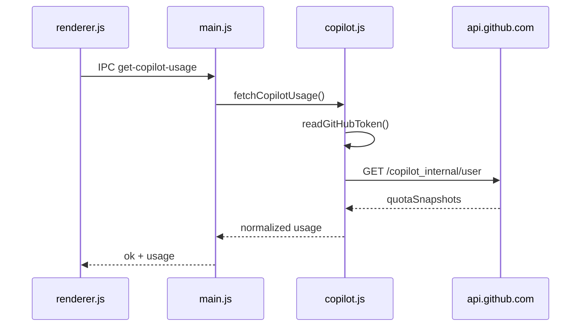

# GitHub Copilot プロバイダ追加 — 設計仕様

**日付:** 2026-07-08  
**テーマ:** A — 新プロバイダ追加  
**ステータス:** 承認待ち  
**関連:** [使用量アラート設計](2026-07-08-usage-alerts-design.md)（テーマ C）

---

## 1. 背景と目的

### 解決したい課題

GenAIUsageWidget は Claude / Codex / Cursor / Antigravity の4プロバイダのみ対応。GitHub Copilot CLI や VS Code 拡張を日常的に使うユーザーは、Copilot のプレミアムリクエスト枠を別途確認する必要がある。

### プロバイダ選定

計画の候補（GitHub Copilot, Windsurf, Gemini CLI）のうち、**GitHub Copilot** を初期追加対象とする。

| 候補 | 評価 | 理由 |
|---|---|---|
| **GitHub Copilot** | 採用 | `copilot-cli` のローカル認証が Win/Linux で確立。非公開だが実績ある `copilot_internal/user` API があり、[CodexBar](https://github.com/steipete/CodexBar/blob/main/docs/copilot.md) で実装先例あり |
| Windsurf | 見送り | 個人向けローカル使用量 API が不明。Enterprise API はサービスキーが必要 |
| Gemini CLI | 見送り | Antigravity とクォータが重複する可能性が高い |

### 目的

`copilot login` 済み（または `GH_TOKEN` 等）の環境で、Copilot の Premium / Chat 枠使用率を既存カード UI と同じパターンで表示する。

### 成功基準

1. `copilot-cli` でサインイン済み（または対応 env トークン）の Win/Linux で Copilot カードが表示される。
2. サマリーメーターと展開詳細（Premium / Chat）が Codex カードと同様の UX で表示される。
3. 未サインイン時はカード非表示（`notConfigured`）。
4. テーマ C（使用量アラート）実装時に Copilot も通知対象に含められる。

### スコープ外（YAGNI）

- GitHub Enterprise Server ホストのカスタム設定 UI
- Budget extras（GitHub Web クッキー経由の予算バー）
- `gh auth token` フォールバック（v2 で env / keychain / config のみ）
- macOS 対応（プロジェクト現状の対象外）
- 複数 GitHub アカウント切り替え

---

## 2. データソース

### 使用量 API

```
GET https://api.github.com/copilot_internal/user
```

**ヘッダー**（CodexBar / VS Code Copilot 拡張と整合）:

| ヘッダー | 値 |
|---|---|
| `Authorization` | `token <github_oauth_token>` |
| `Accept` | `application/json` |
| `Editor-Version` | `vscode/1.96.2` |
| `Editor-Plugin-Version` | `copilot-chat/0.26.7` |
| `User-Agent` | `GitHubCopilotChat/0.26.7` |
| `X-Github-Api-Version` | `2025-04-01` |

### レスポンスマッピング

| API フィールド | UI 表示 |
|---|---|
| `quotaSnapshots.premiumInteractions` | Primary — 「Premium」 |
| `quotaSnapshots.chat` | Secondary — 「Chat」 |
| `quotaResetDate` | 両枠の `resetsAt`（ISO 日付または `yyyy-MM-dd`） |
| `copilotPlan` | サブテキスト（プラン名、任意） |

**使用率の算出:**

API は `percentRemaining`（残量）を返す。既存メーターは「使用済み %」なので:

```
usedPercent = 100 - percentRemaining
```

`isPlaceholder: true` または `percentRemaining` 欠落の枠はスキップ。Token-based billing でプレースホルダーのみの場合は「No quota data」表示。

### 返却形状（`fetchCopilotUsage()`）

Codex と同型:

```javascript
{
  primary: { percent, resetsAt } | null,
  secondary: { percent, resetsAt } | null,
  plan: string | null,  // copilotPlan
}
```

---

## 3. 認証情報の取得

`copilot-cli` と同じ優先順位でトークンを解決する:

| 優先度 | ソース |
|---|---|
| 1 | `process.env.COPILOT_GITHUB_TOKEN` |
| 2 | `process.env.GH_TOKEN` |
| 3 | `process.env.GITHUB_TOKEN` |
| 4 | OS キーストア（サービス名 `copilot-cli`） |
| 5 | `~/.copilot/config.json`（プレーンテキストフォールバック時） |

### プラットフォーム別

**Windows:** 既存 [`win-cred-read.py`](../../../src/providers/win-cred-read.py) を流用。ターゲット `copilot-cli`。Blob は JSON の可能性があるため、パースして `token` / `access_token` / 生文字列を順に試す。

**Linux（libsecret あり）:**

```bash
secret-tool lookup service copilot-cli
```

`secret-tool` 未インストールまたは未ヒット時は `~/.copilot/config.json` にフォールバック。

**Linux（config.json）:** `config.json` 内の認証フィールドからトークンを抽出（CLI が管理する内部スキーマ。実装時に `copilot login` 後のファイルを確認してパーサを確定）。

いずれもトークンが得られなければ `notConfigured('GitHub Copilot CLI is not signed in on this machine')`。

---

## 4. アプローチ比較

### 案 A: 最小 — env + config.json のみ

| 長所 | 短所 |
|---|---|
| 実装が最も簡単 | keychain 利用者（通常の `copilot login`）に非対応 |

### 案 B: env + keychain + config（推奨）

| 長所 | 短所 |
|---|---|
| 通常の Copilot CLI ユーザーに対応 | Windows は Python 依存（Antigravity と同じ） |
| 既存 `win-cred-read.py` パターン再利用 | Linux keyring は `secret-tool` 依存 |

### 案 C: フル — `gh auth token` フォールバック追加

| 長所 | 短所 |
|---|---|
| `gh` のみログイン済みでも動作 | `gh` サブプロセス依存、スコープ不一致のリスク |

**推奨: 案 B** — 既存 Antigravity パターンと整合し、大半のユーザーをカバー。

---

## 5. アーキテクチャ



### 変更ファイル

| ファイル | 変更内容 |
|---|---|
| `src/providers/copilot.js` | 新規 — `fetchCopilotUsage()` |
| `src/providers/linux-secret-read.sh` | 新規（任意）— `secret-tool` ラッパ、または `execFileSync` で直接呼び出し |
| `src/main.js` | IPC `get-copilot-usage` 追加 |
| `src/preload.js` | `getCopilotUsage` 公開 |
| `src/renderer.js` | `updateCopilotCard()` 追加 |
| `src/index.html` | Copilot タイル追加（アクセント色 `--id-copilot`） |
| `src/alerts.js` | （テーマ C 実装時）`PROVIDER_LABELS.copilot` 追加 |
| `README.md` / `README.ja.md` | プロバイダ表・認証ソース追記 |

### UI 配置

- カード順: Claude → Codex → **Copilot** → Antigravity → Cursor（README のアルファベット順に近い配置）
- アクセント色: `--id-copilot: #1f6feb`（GitHub ブルー系）
- カード表示ロジックは Codex と同型（primary サマリー、secondary があれば展開可能）

---

## 6. エラー処理

| 状況 | 動作 |
|---|---|
| トークンなし | `notConfigured` → カード非表示 |
| 401 / 403 | `Error: Copilot usage request failed: 401` → エラー表示 |
| 200 だがクォータなし | 「No quota data」、メーター非表示 |
| Windows で Python なし（keychain 利用時） | `notConfigured` + メッセージに Python 要件を明記 |
| 429 | エラー表示（Claude のような専用バックオフは v1 では不要） |

---

## 7. テーマ C との統合

[使用量アラート設計](2026-07-08-usage-alerts-design.md) の代表メーターに Copilot を追加:

| プロバイダ | 代表パーセント |
|---|---|
| Copilot | `primary.percent`（なければ `secondary.percent`） |

`updateCopilotCard()` 末尾で `reportUsage('copilot', ...)` を呼ぶ。

---

## 8. テスト方針

1. **手動 — 未設定:** トークンなし環境でカードが非表示になること
2. **手動 — 設定済み:** `copilot login` 後に Premium/Chat メーターが表示されること
3. **手動 — env:** `GH_TOKEN=... npm start` で keychain なしでも動作すること
4. **回帰:** 既存4プロバイダの表示・並び替えに影響がないこと

---

## 9. ドキュメント追記（README）

| プロバイダ | 取得元 | 備考 |
|---|---|---|
| Copilot | `copilot-cli` キーストア（`copilot-cli`）/ `~/.copilot/config.json` / `COPILOT_GITHUB_TOKEN`・`GH_TOKEN`・`GITHUB_TOKEN` | `copilot login` が必要。Windows keychain 読取は Python + `win-cred-read.py` |

---

## 10. セルフレビュー

| チェック | 結果 |
|---|---|
| プレースホルダー | なし（config.json パースは実装時に実ファイルで確定と明記） |
| 内部矛盾 | なし |
| スコープ | 単一プロバイダ追加として計画可能 |
| 既存パターン整合 | `fetchXUsage()` + `notConfigured` + Codex 型 UI |

---

## 11. 承認

本仕様承認後、`docs/superpowers/plans/2026-07-08-github-copilot-provider.md` に従って実装します。テーマ C と併せて実装する場合は、Copilot カード追加後にアラート統合タスクを実行します。
