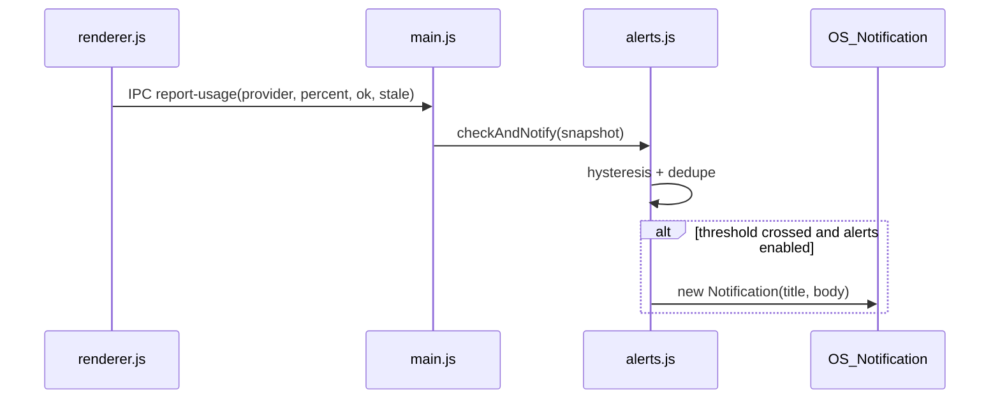

# 使用量アラート — 設計仕様

**日付:** 2026-07-08  
**テーマ:** C — UI/UX 改善（使用量アラート）  
**ステータス:** 承認待ち

---

## 1. 背景と目的

### 解決したい課題

GenAIUsageWidget はトレイ/ウィジェット上で使用量を視覚的に表示するが、ユーザーが常に画面を見ていない場合、使用量が 70% / 90% を超えても気づけない。既存 UI は `severityClass()` でメーター色を変えるだけで、OS レベルの通知はない。

### 目的

設定済みプロバイダの使用量が警告・危険閾値を超えたとき、OS ネイティブ通知でユーザーに知らせる。ウィジェットを開いていなくても、使用量の急増に気づけるようにする。

### 成功基準

1. いずれかの設定済みプロバイダの代表メーターが **70%（警告）** または **90%（危険）** を初めて超えたとき、OS 通知が1回表示される。
2. 同じ閾値帯に留まっている間、1分ごとのポーリングで通知が繰り返されない（ヒステリシス付き）。
3. トレイ右クリックメニューからアラートの ON/OFF を切り替えられ、設定は再起動後も保持される（デフォルト ON）。
4. 未設定プロバイダ・取得エラー・stale データでは通知しない。
5. Windows / Linux の両方で動作する（既存の対応プラットフォームに限定）。

### スコープ外（YAGNI）

- カスタム閾値の UI（初期版は既存 UI と同じ 70% / 90% 固定）
- プロバイダごとの個別 ON/OFF
- 使用量履歴の保存・グラフ表示
- macOS 対応（現状プロジェクトの対象外）
- サウンドやトレイアイコンバッジの変更

---

## 2. 要件の詳細

### 代表メーターの定義

通知判定に使う「代表パーセント」は、各カードのサマリーメーター（`setMeter()` に渡す値）と一致させる。

| プロバイダ | 代表パーセント | 根拠（既存 `renderer.js`） |
|---|---|---|
| Claude | `session.percent` | サマリーメーターはセッション枠 |
| Codex | `primary.percent` | サマリーは primary 枠 |
| Cursor | `percent` (Total) | サマリーは Total |
| Antigravity | `max(groups[].percent)` | グループ中の最大値 |

### 閾値とヒステリシス

既存 UI の `severityClass()` と整合:

| レベル | 通知トリガー（上方向） | リセット（下方向） |
|---|---|---|
| warning | ≥ 70% | < 65% |
| critical | ≥ 90% | < 85% |

- warning と critical は独立に追跡する（90% 超えで critical 通知、70% 帯の warning 状態は別管理）。
- 使用量がリセット閾値を下回ったら、そのレベルの「通知済み」状態をクリアし、再度超えたときに再通知できる。

### 通知しない条件

- プロバイダが `notConfigured`（カード非表示）
- API エラー（`result.ok === false`）
- Claude の stale データ（`result.stale === true`）— 古いスナップショットでの誤通知を防ぐ
- アラートがユーザーにより OFF
- Electron `Notification.isSupported()` が false

### 設定の永続化

- 保存先: `app.getPath('userData')/settings.json`
- スキーマ（初期版）:

```json
{
  "alertsEnabled": true
}
```

- `autostart.js` と同様、main プロセスが読み書きする。

---

## 3. アプローチ比較

### 案 A: レンダラー側で判定・通知

`renderer.js` の `updateAll()` 後に閾値を判定し、IPC 経由で main に通知依頼。

| 長所 | 短所 |
|---|---|
| 代表パーセントの計算ロジックが既に renderer にある | popup と widget の **2 ウィンドウ** がそれぞれ IPC を送り、重複通知のリスク |
| 変更ファイルが少ない | 通知ロジックが UI 層に入る |

### 案 B: main プロセスでポーリング一元化

main が 60 秒タイマーで全プロバイダを取得し、通知と UI 更新の両方を担う。

| 長所 | 短所 |
|---|---|
| 単一の真実の源 | renderer のポーリング構造を大幅変更（push モデルへ） |
| 重複通知なし | Claude キャッシュ/429 バックオフロジックの移設が必要で変更範囲が大きい |

### 案 C: main 側モジュール + renderer からスナップショット報告（推奨）

`src/alerts.js` を新設。renderer は各カード更新後に正規化されたメトリクスを IPC `report-usage` で main に送る。main の `alerts.js` が重複排除・ヒステリシス・通知を担当。

| 長所 | 短所 |
|---|---|
| 通知は main で一元化、重複は main 側で吸収 | renderer に薄い報告コードが増える |
| 既存ポーリング/キャッシュ構造を維持 | 2 ウィンドウからの報告は来るが、状態は main でマージ |
| `autostart.js` と同パターンで設定モジュール化可能 | — |

**推奨: 案 C** — 最小の変更で重複通知を防ぎ、既存アーキテクチャ（renderer ポーリング + main IPC）を維持できる。

---

## 4. アーキテクチャ



### 新規・変更ファイル

| ファイル | 責務 |
|---|---|
| `src/alerts.js` | 閾値判定、ヒステリシス状態、OS 通知発火 |
| `src/settings.js` | `alertsEnabled` の読み書き・永続化 |
| `src/main.js` | `report-usage` IPC ハンドラ、トレイメニューにチェックボックス追加 |
| `src/preload.js` | `reportUsage()` API 公開 |
| `src/renderer.js` | 各 `update*Card()` 末尾でスナップショット報告 |

### `src/alerts.js` インターフェース

```javascript
// 閾値定数（renderer の severityClass と一致）
const WARNING_ENTER = 70;
const WARNING_EXIT = 65;
const CRITICAL_ENTER = 90;
const CRITICAL_EXIT = 85;

// providerId: 'claude' | 'codex' | 'cursor' | 'antigravity'
// snapshot: { percent: number | null, ok: boolean, stale?: boolean }
function checkAndNotify(providerId, snapshot, { enabled });

function resetState(); // テスト用
```

内部状態（メモリのみ、再起動でリセット — 再起動直後に閾値超えなら再通知してよい）:

```javascript
// Map<providerId, { warning: 'below'|'active'|'notified', critical: ... }>
```

### 通知フォーマット

```
Title: GenAIUsageWidget — {ProviderName} {Warning|Critical}
Body:  Usage at {percent}% ({label})
```

例: `GenAIUsageWidget — Claude Warning` / `Usage at 72% (session)`

---

## 5. データフロー

1. `renderer.js` が 60 秒ごとに `updateAll()` を実行（既存）。
2. 各 `update*Card()` が成功時、代表 `percent` を算出して `window.api.reportUsage({ provider, percent, ok, stale })` を呼ぶ。
3. 失敗/`notConfigured` 時は `ok: false` で報告（alerts はスキップ）。
4. `main.js` の `ipcMain.on('report-usage', ...)` が `settings.isAlertsEnabled()` と `alerts.checkAndNotify()` を呼ぶ。
5. 2 ウィンドウから同一タイミングで報告が来ても、main の状態マシンは idempotent（同じ percent・同じ notified 状態なら何もしない）。

### renderer 報告の追加例（Claude）

```javascript
window.api.reportUsage({
  provider: 'claude',
  percent: session.percent,
  ok: true,
  stale: !!result.stale,
});
```

---

## 6. エラー処理

| 状況 | 動作 |
|---|---|
| `percent` が `null` | 通知判定スキップ |
| `ok: false` | 通知判定スキップ、状態は変更しない |
| `stale: true` | 通知判定スキップ（誤報防止） |
| `Notification` 非対応 | `checkAndNotify` 内で早期 return |
| 通知 permission 未付与（Linux） | 初回は黙ってスキップ。README に `libnotify` 依存を追記 |

---

## 7. UI 変更

トレイ右クリックメニュー（`createTray()`）に追加:

```
☑ Usage Alerts
```

- `autostart` チェックボックスと同じパターン
- OFF にしたら即座に以降の通知を抑制（メモリ状態は保持、ON に戻しても閾値を下回るまで再通知しない）

---

## 8. テスト方針

このプロジェクトにテストランナーは未導入。初期版は以下で検証:

1. **手動テスト**: `alerts.js` の閾値ロジックを Node で単体実行できるよう `module.exports` と、開発用に percent を注入する簡易スクリプト（または `node -e`）でヒステリシスを確認。
2. **統合テスト**: `npm start` 後、開発者が各プロバイダの実データまたはモック IPC で通知発火を確認。
3. **回帰**: アラート OFF 時・stale 時・エラー時に通知が出ないことを確認。

将来テストランナー導入時は `alerts.js` の状態マシンをユニットテスト化する。

---

## 9. ドキュメント更新

`README.md` / `README.ja.md` の Features セクションに以下を追記:

- 70% / 90% 到達時の OS 通知
- トレイメニューからの ON/OFF
- Linux では libnotify（多くの DE で標準）が必要な場合がある旨

---

## 10. セルフレビュー

| チェック項目 | 結果 |
|---|---|
| プレースホルダー（TBD 等） | なし |
| 内部矛盾 | なし — 代表パーセントは renderer と一致 |
| スコープ | 単一機能として実装計画に収まる |
| 曖昧さ | 閾値・ヒステリシス・通知条件を数値で固定済み |

---

## 11. 承認

本仕様はブレインストーミングフェーズの成果物です。実装に進む前にレビューをお願いします。

変更希望がなければ、次のステップとして `docs/superpowers/plans/2026-07-08-usage-alerts.md` の実装計画に従って開発を開始します。
